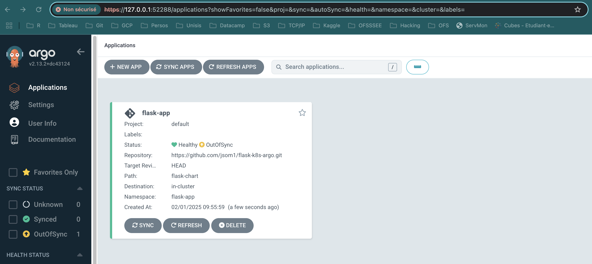
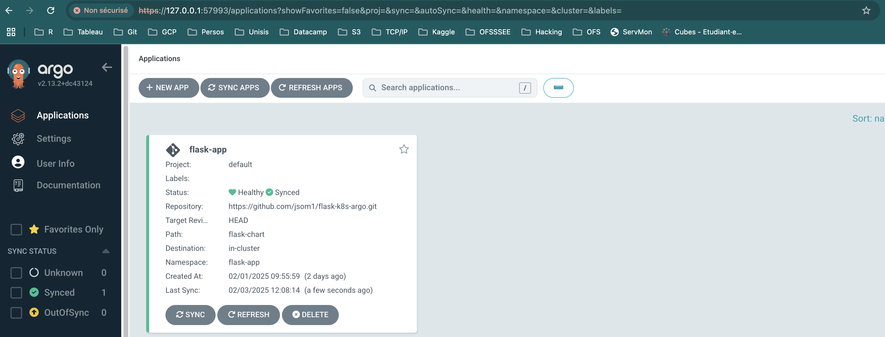
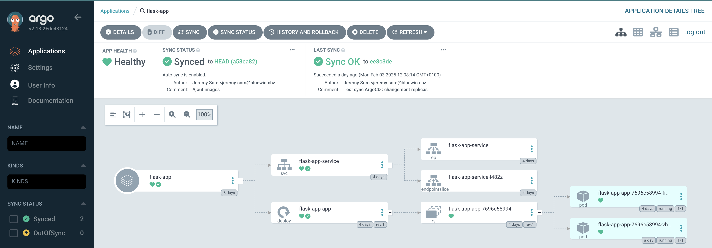
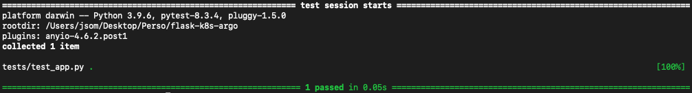
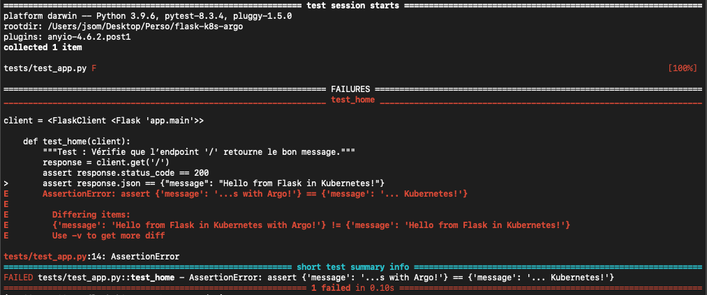
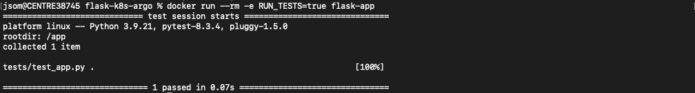
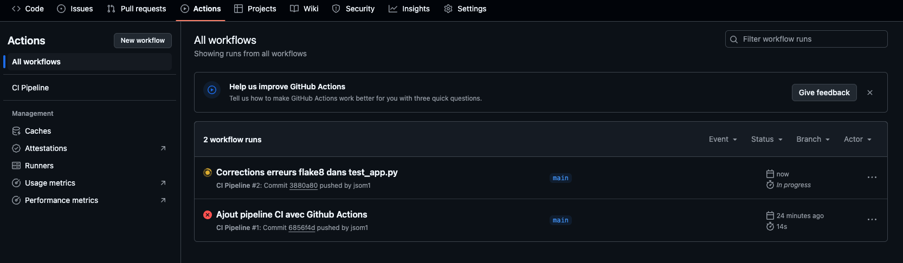
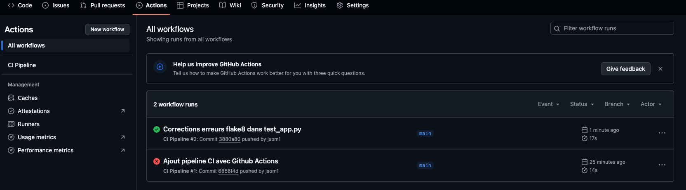
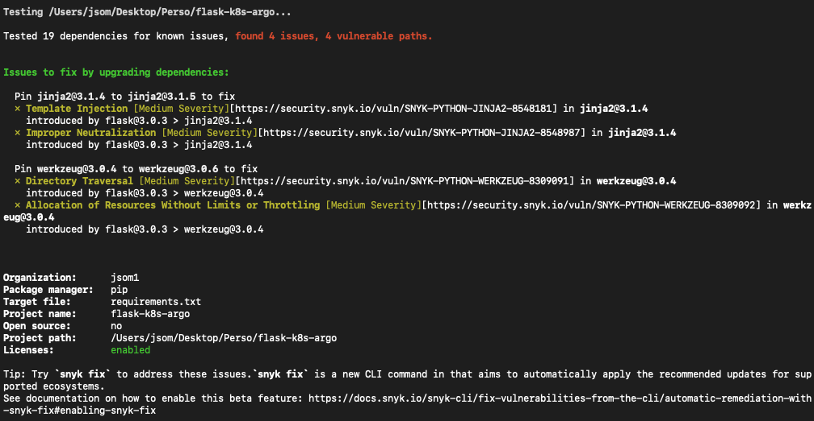
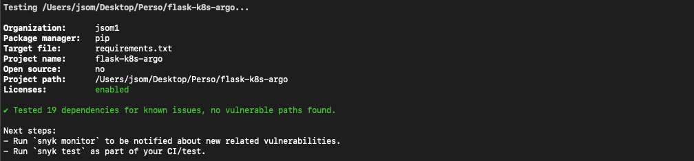

# Du code au cluster : un workflow DevOps complet

---

- 1. **[Introduction](#introduction)**
  - [1.1 Structure](#structure) 
  - [1.2 Technologies](#technologies) 
  - [1.3 Concepts](#concepts)  

- 2. **[Mise en place d'un pipeline basique](#mise-en-place-dun-pipeline-basique)**
  - [2.1 Objectifs de base](#objectifs-de-base)
  - [2.2 Développement de l’application (API Flask)](#développement-de-lapplication-api-flask)
  - [2.3 Containerisation avec Docker](#containerisation-avec-docker)
  - [2.4 Déploiement statique sur Kubernetes avec Minikube](#déploiement-statique-sur-kubernetes-avec-minikube)
  - [2.5 Déploiement dynamique avec Helm](#déploiement-dynamique-avec-helm)
  - [2.6 Automatisation avec Argo CD](#automatisation-avec-argo-cd)
    
- 3. **[Renforcement du pipeline : qualité, sécurité et tests](#renforcement-du-pipeline-qualité-sécurité-et-tests)**
  - [3.1 Objectifs avancés](#objectifs-avancés)
  - [3.2 Tests et qualité du code avec Pytest et flake8](#tests-et-qualité-du-code-avec-pytest-et-flake8)
  - [3.3 Sécurité](#sécurité)

- 4. **[Conclusion](#conclusion)**


---

# 1. Introduction

Ce projet vise à appliquer un workflow DevOps complet, de la création d’une application simple jusqu'à sa mise en production automatisée sur *Kubernetes* en suivant les pratiques *GitOps*. Il inclut également les bonnes pratiques en matière de qualité et sécurité.

## 1.1 Structure

Le projet est organisé en **2 parties** :

-	**Mise en place d'un pipeline basique** : dans un premier temps, le but sera de développer et automatiser le déploiement d’une application web minimaliste en suivant un workflow DevOps standard.
L’application, développée en Python avec *Flask*, sera contenue dans un container *Docker*, puis déployée sur un cluster *Kubernetes* via *MiniKube*, et gérée avec *Helm* et *ArgoCD*.

-	**Renforcement du pipeline : qualité, sécurité et tests** : dans un second temps, le but sera d'améliorer la qualité et la sécurité de l’application en intégrant des tests unitaires et d’intégration avec *Pytest*, ainsi que des scans de vulnérabilité avec *Snyk*.

## 1.2 Technologies
- **Langage & Framework** : Python (Flask)
- **Containerisation & Orchestration** : Docker, Kubernetes (Minikube)
- **Déploiement & Automatisation** : Helm, Argo CD, GitOps
- **Sécurité** : Snyk
- **Qualité du code** : Flake8, Pytest

## 1.3 Concepts
- **CI/CD** (*Continuous Integration and Continuous Deployment*) : automatisation des tests et du déploiement de l'application à chaque mise à jour du code. Ceci est assuré par *GitHub* et *Argo CD*, qui surveillent les changements et déclenchent les mises à jour sur Kubernetes
- **GitOps** : approche où Git sert de source unique de vérité (*Single Source of Truth*) pour les déploiements. Argo CD surveille le repo Git et s'assure que l'état du cluster Kubernetes reflète toujours les fichiers de configuration stockés dans le repo
- **Infrastructure as Code** (*IaC*) : utilisation de fichiers YAML et de Helm Charts pour définir et automatiser l'infrastructure. Cela permet une gestion reproductible et versionnée des ressources Kubernetes
- **Cloud-native et containerisation** : l'application est conçue pour être *Cloud-native*, c'est-à-dire :
  - conteneurisée avec *Docker* pour assurer portabilité et isolation
  - Déployée et gérée avec Kubernetes pour la scalabilité et la résilience
  - Structurée de manière modulaire, ce qui favorise la flexibilité et l'évolutivité
- **Sécurité** (DevSecOps) : la sécurité est intégrée dès le début du processus DevOps grâce à : 
  - scan des vulnérabilités des images Docker
  - contrôle des accès et permissions dans Kubernetes
  - Bonnes pratiques pour éviter les failles courantes (pas de secrets en clair, limiter les droits des containers, etc...)
- **Tests** (qualité du code) : Intégration de *Pytest* pour les tests unitaires et d'intégration, afin d'assurer la robustesse et la fiabilité du code avant son déploiement. Utilisation de *flake8* pour la qualité du code

---

# 2. Mise en place d'un pipeline basique

## 2.1 Objectifs de base
1. **[Développement de l’application](#développement-de-lapplication-api-flask)** : création d’une API Flask simple avec un  endpoint : GET / qui retourne le message « Hello from Flask in Kubernetes ! ».
2. **[Containerisation avec Docker](#containerisation-avec-docker)** : packaging de l’application sous forme d’image Docker pour garantir la portabilité et la reproductibilité.
3. **[Déploiement statique sur Kubernetes](#déploiement-statique-sur-kubernetes)** : création et gestion des ressources Kubernetes (deployment, service, namespace) avec des manifests YAML statiques.
4. **[Déploiement dynamique avec Helm](#déploiement-dynamique-avec-helm)** : transformation des manifests statiques en templates Helm, permettant un déploiement flexible et évolutif.
5. **[Automatisation avec Argo CD](#automatisation-avec-argo-cd)** : mise en place d’une approche GitOps avec Argo CD pour surveiller un repo Git et déployer automatiquement les changements sur le cluster Kubernetes.

---

## 2.2 Développement de l’application (API Flask)

### 2.2.1 Structure du projet

```bash
flask-k8s-argo/
│── app/
│   ├── main.py       # Code de l'API Flask
│   ├── __init__.py   # Pour que Python considère le dossier /app comme un module
│── requirements.txt  # Dépendances (Flask)
│── Dockerfile        # Fichier pour Docker
│── .gitignore
│── .git
```
On commence par créer le répertoire *flask-k8s-argo* et on passe dedans. On crée aussi les différents fichiers nécessaires :

```bash
mkdir flask-k8s-argo && cd flask-k8s-argo
mkdir app
touch app/main.py
touch app/__init__.py
touch requirements.txt
touch Dockerfile
touch .gitignore
```

Pour commiter sur Github, il faut encore initialiser un repo git (nécessaire aussi plus tard pour ArgoCD)

```bash
git init
```

Ensuite, on peut écrire le code de l'application.

### 2.2.2 Code Flask (`app/main.py`)

```python
from flask import Flask, jsonify

app = Flask(__name__)

@app.route('/')
def home():
    return jsonify(message="Hello from Flask in Kubernetes with Argo!")

if __name__ == '__main__':
    app.run(host='0.0.0.0', port=5000)
```

Facultativement, on peut aussi spécifier le contenu du fichier *__init__.py* :

```python
# app/__init__.py
from flask import Flask

app = Flask(__name__)

from app import main  # Import du fichier main.py

```

### 2.2.3 Installation des dépendances

Les dépendances requises sont listées dans le fichier *requirements.txt*. Actuellement, nous n'avons besoin que de Flask:

```bash
echo flask > requirements.txt
```
Ensuite, on peut installer les dépendances requises (Flask)

```bash
pip install -r requirements.txt
```

Si ça ne marche pas, par exemple parce que *pip* n'est pas dans le *PATH*, on peut aussi installer Flask via Python :

```bash
python3 -m pip install -user flask
```

### 2.2.4 Test en local

A ce stade, on peut déjà vérifier que l'application fonctionne :

```bash
python3 app/main.py
```
Le message suivant devrait apparaîte : "*Running on http://127.0.0.1:5000*". On peut soit se rendre à cette URL dans un browser, ou simplement utiliser *curl* :

```bash
curl http://127.0.0.1:5000
```
Le message "*Hello from Flask in Kubernetes with Argo!*" devrait s'afficher.

---

## 2.3 Containerisation avec Docker

### 2.3.1 Dockerfile

Maintenant qu'on sait que l'application fonctionne, on peut la containeriser. On commence par créer le Dockerfile :

```dockerfile
# Utiliser une image Python légère
FROM python:3.9-slim

# Définir le répertoire de travail
WORKDIR /app

# Copier les fichiers nécessaires
COPY requirements.txt ./
COPY app ./app

# Installer Flask
RUN pip install --no-cache-dir -r requirements.txt

# Exposer le port 5000 sur lequel l’application écoutera
EXPOSE 5000

# Lancer l'application
CMD ["python3", "app/main.py"]
```

### 2.3.2 Build & run

Maintenant, ce Dockerfile peut être utilisé pour créer une image Docker qu'on appellera *flask-app* :

```bash
docker build -t flask-app .
```
Les images existantes sont visibles avec la commande suivante :

```bash
docker images
```
Finalement, on peut lancer le container :

```bash
docker run -p 5000:5000 flask-app
```

On devrait à nouveau avoir le message "*Hello from Flask in Kubernetes with Argo!*".

---

## 2.4 Déploiement statique sur Kubernetes avec Minikube

### 2.4.1 Installation & démarrage

Maintenant qu'on a un container Docker qui fonctionne, on peut le déployer dans un cluster Kubernetes. On peut utiliser GKE (Google Kubernetes Engine, payant et accessible depuis l'extérieur) ou Minikube (gratuit, local). On utilisera ici Minikube.

```bash
brew install minikube
minikube version
```
Si l'installation s'est bien passée, on peut démarrer un cluster localement :

```bash
minikube start
```
On vérifie l'état du cluster:

```bash
kubectl get nodes
```
Si *Status=Ready*, le cluster est opérationnel. On peut créer un namespace pour l'application. Ceci permet de la séparer d'autres applications éventuelles, et donc de bien gérer les ressources Kubernetes.

### 2.4.2 Création du namespace Kubernetes

```bash
kubectl create namespace flask-app
kubectl get namespaces
```
Le namespace *flask-app* devrait apparaître dans la liste. Les namespaces suivants sont créés automatiquement par Kubernetes :

-	Default : namespace par défaut si on ne précise rien au moment du déploiement. Toutes les ressources sans namespace explicite iront ici
-	Kube-node-lease : gère la communication entre les nœuds du cluster pour savoir s’ils sont actifs
-	Kube-public : contient des ressources accessibles publiquement
-	Kube-system : namespace où tournent les services de k8s (DNS, scheduluer, API server, etc…)

Maintenant que Minikube tourne et qu’on a un namespace, on peut passer au déploiement.

### 2.4.3 Manifests YAML (`manifests/`)

Pour le déploiement, il nous faut deux manifests YAML :

-	**Deployment** : gère la création et la mise à jour du container Flask
-	**Service** : expose l’application pour qu’elle soit accessible

On place ces manifests dans un dossier *manifests*. La stucture du projet mis à jour est la suivante :

```bash
flask-k8s-argo/
│── app/ 
	│── main.py
	│── __init__.py
│── manifests/ 
	│── deployment.yaml
	│── service.yaml
│── requirements.txt 
│── Dockerfile 
│── .gitignore
│── .git
```

On peut donc créer le dossier, passer dedans et créer les manifests : 

```bash
mkdir manifests && cd manifests
touch deployment.yaml service.yaml
```

Le contenu des manifests est le suivant :

#### `deployment.yaml`

```yaml
apiVersion: apps/v1
kind: Deployment
metadata:
  name: flask-app
  namespace: flask-app
  labels:
    app: flask-app
spec:
  replicas: 1
  selector:
    matchLabels:
      app: flask-app
  template:
    metadata:
      labels:
        app: flask-app
    spec:
      containers:
        - name: flask-app
          image: flask-app
          imagePullPolicy: Never
          ports:
            - containerPort: 5000
```

Le paramètre *imagePullPolicy: Never* force Kubernetes à utiliser l'image locale.

#### `service.yaml`

```yaml
apiVersion: v1
kind: Service
metadata:
  name: flask-service
  namespace: flask-app
spec:
  selector:
    app: flask-app
  type: NodePort
  ports:
    - protocol: TCP
      port: 80
      targetPort: 5000
      nodePort: 30007
```

On définit ici un service de type NodePort en dur (normalement Kubernetes assigne automatiquement un port entre 30'000 et 32'767). Un NodePort expose un port spécifique sur tous les noeuds du cluster, ce qui permet un accès externe à une application.

Un noeud est une machine (physique ou virtuelle) qui exécute les applications Kubernetes. Dans Minikube, tout tourne sur une seule machine virtuelle.
Un Service NodePort ouvre un port sur tous les *workers nodes* du cluster pour permettre un accès externe.
Dans Minikube, tout est sur une seule machine, donc ça fonctionne localement.

Il faut noter que NodePort est pratique pour tester localement, mais pas recommandé en production. En production, on utiliserait plutôt des *ingress controllers* ou *LoadBalancers*.

Une fois les manifests créés, on peut les appliquer dans Kubernetes.

### 2.4.4 Application des manifests

Concrètement, Kubernetes va lire ces manifests et créer les ressources correspondantes.

```bash
kubectl apply -f manifests/deployment.yaml
kubectl apply -f manifests/service.yaml
```
Kubernetes crée donc un déploiement qui gère le container Flask, et un service qui permet d'y accéder. On vérifie que tout fonctionne correctement :

```bash
kubectl get pods -n flask-app
kubectl get services -n flask-app
```

On vérifie finalement que l'application tourne bien dans Kubernetes :

```bash
Kubectl get services -n flask-app
```

Le résultat de cette commande devrait ressembler à ceci :

| NAME          | TYPE      | CLUSTER-IP       | EXTERNAL-IP | PORT(S)       | AGE   |
|--------------|----------|------------------|-------------|--------------|------|
| flask-service | NodePort | 10.111.255.215   | <none>      | 80:30007/TCP | 2m47s |

L'adresse IP du cluster, *10.111.255.215*, n'est accessible que depuis l'intérieur du cluster. *Port(s)=80:300007/TCP* indique que le port 30007 du noeud (le NodePort accessible depuis l'extérieur) est redirigé vers le port 80 du service, qui est lui-même redirigé vers le port 5000 de l'application Flask.

### 2.4.5 Accès à l'application

A ce stade, il y a deux manière d'accéder à l'application :

1. La méthode *port-forward* de kubectl permet de rediriger temporairement un port local vers l'application :

```bash
kubectl port-forward -n flask-app pod/$(kubectl get pod -n flask-app -o jsonpath='{.items[0].metadata.name}') 5000:5000
```
L'application devrait être accessible à l'adresse *http://127.0.0.1:5000*.

2. La méthode *service* de Minikube permet d'exposer directement un service sur localhost :

```bash
minikube service flask-service -n flask-app --url
```

Cette commande renvoie une URL temporaire, aussi utilisable dans un browser ou via *curl*.

Actuellement, l'application tourne bien dans Kubernetes avec des manifests YAML statiques. 

---

## 2.5 Déploiement dynamique avec Helm

Le "problème" des manifests statiques est que si on veut modifier des valeurs comme le nombre de *replicas*, l'image Docker, le NodePort, etc..., il faudrait aller modifier ces fichiers manuellement à chaque changement.

*Helm* permet de transformer ces fichiers YAML en **templates**, ce qui permet une configuration dynamique et non plus statique. Cela se fait grâce au fichier *values.yaml*.

### 2.5.1 Installation de Helm

*Helm* peut être installé avec la commande suivante (sur Mac) :

```bash
brew install helm
helm version
```

### 2.5.2 Structure du Chart Helm

Une fois installé, la commande suivante crée un **chart Helm** dans le répertoire du projet (nommé ici *flask-chart*) :

```bash
helm create flask-chart 
```

Des dossiers et fichiers sont automatiquement créés, et la nouvelle structure du projet est la suivante :

```bash
flask-k8s-argo/
│── app/ 
│   ├── main.py
│   ├── __init__.py
│── flask-chart/              # Dossier du chart Helm
│   ├── charts/               # Sous-charts Helm (non utilisé ici)
│   ├── templates/            # Contient les templates YAML pour Kubernetes
│   │   ├── deployment.yaml   # Template pour le Deployment
│   │   ├── service.yaml      # Template pour le Service
│   │   ├── _helpers.tpl      # Fonctions réutilisables pour Helm
│   │   ├── NOTES.txt         # Message affiché après installation du chart
│   │   ├── hpa.yaml          # Pour le scaling automatique (non utilisé ici)
│   │   ├── ingress.yaml      # Pour exposer via un ingress controller (optionnel)
│   ├── values.yaml           # Contient les variables dynamiques
│   ├── Chart.yaml            # Métadonnées du Chart (nom, version, description)
│   ├── .helmignore           # Fichiers à ignorer (comme .gitignore)
│── manifests/                # Ce dossier deviendra obsolète avec Helm)
│   ├── deployment.yaml       # (sera remplacé par Helm)
│   ├── service.yaml          # (sera remplacé par Helm)
│── requirements.txt	
│── Dockerfile		
│── .gitignore			
│── .git

```

Le fichier *values.yaml* contiendra les variables dynamiques (comme le nom du container, les *replicas*, l'image Docker, etc...). Ces fichiers sont déjà remplis avec des explications quant à leur utilisation.

Il faut modifier les fichiers suivants :

#### `Chart.yaml`

```yaml
apiVersion: v2
name: flask-chart
description: A Helm chart for deploying a Flask app on Kubernetes

type: application

# Version du chart Helm
version: 0.1.0

# Version de l'application
appVersion: "1.0.0"
```

#### `values.yaml`

```yaml
replicaCount: 1

image:
  repository: flask-app
  tag: latest
  pullPolicy: Never

serviceAccount: create: false

ingress:
  enabled: false

autoscaling:
  enabled: false
  minReplicas: 1
  maxReplicas: 5
  targetCPUUtilizationPercentage: 80

service:
  type: NodePort
  port: 80
  targetPort: 5000
  nodePort: 30007

resources: {}

nodeSelector: {}

tolerations: []

affinity: {}
```

#### `templates/deployment.yaml`

```yaml
apiVersion: apps/v1
kind: Deployment
metadata:
  name: {{ .Release.Name }}-app
  namespace: {{ .Release.Namespace }}
  labels:
    app: {{ .Release.Name }}-app
spec:
  replicas: {{ .Values.replicaCount }}
  selector:
    matchLabels:
      app: {{ .Release.Name }}-app
  template:
    metadata:
      labels:
        app: {{ .Release.Name }}-app
    spec:
      containers:
        - name: flask-app
          image: "{{ .Values.image.repository }}:{{ .Values.image.tag }}"
          imagePullPolicy: {{ .Values.image.pullPolicy }}
          ports:
            - containerPort: {{ .Values.service.targetPort }}
```

#### `templates/service.yaml`

```yaml
apiVersion: v1
kind: Service
metadata:
  name: {{ .Release.Name }}-service
  namespace: {{ .Release.Namespace }}
spec:
  selector:
    app: {{ .Release.Name }}-app
  type: {{ .Values.service.type }}
  ports:
    - protocol: TCP
      port: {{ .Values.service.port }}
      targetPort: {{ .Values.service.targetPort }}
      nodePort: {{ .Values.service.nodePort }}
```

### 2.5.3 Installation du Chart Helm

A ce stade, l'application est prête à être redéployée avec *Helm* :

```bash
helm install flask-app ./flask-chart --namespace flask-app
helm list -n flask-app
```

Finalement, l'URL d'accès à l'application peut être récupérée avec la commande suivante :

```bash
minikube service flask-app-service -n flask-app –url
```

Si tout fonctionne, un peu supprimer ces fichiers obsolètes :

```bash
│── manifests/                # Remplacé par Helm
│   ├── deployment.yaml       # Remplacé par Helm
│   ├── service.yaml          # Remplacé par Helm
```

---

## 2.6 Automatisation avec Argo CD

Actuellement, on a un déploiement dynamique avec Helm, mais l’application est toujours déployée manuellement avec la commande *helm install*.
L’objectif est maintenant d’automatiser entièrement les déploiements en suivant une approche GitOps grâce à Argo CD. 
L'idée est qu'Argo CD automatise le déploiement de l'application en se basant sur un repo Git comme unique source de vérité ; il assure que ce qui est déployé correspond toujours à l'état défini dans Git.

C'est donc un bon moment pour créer un repo Git (si pas déjà le cas). 

### 2.6.1 Installation d'Argo CD

Argo CD peut être installé directement dans Kubernetes via *kubectl* :

```bash
kubectl create namespace argocd
kubectl apply -n argocd -f https://raw.githubusercontent.com/argoproj/argo-cd/stable/manifests/install.yaml
```

La commande suivante permet de contrôler que l'installation s'est déroulée correctement :

```bash
kubectl get pods -n argocd
```
Les pods doivent être en *Running* avec *Ready 1/1* (ça peut prendre quelques minutes).

### 2.6.2 Exposer Argo CD et y accéder

Par défaut, Argo CD tourne en mode *ClusterIP* et n'est pas accessible depuis l'extérieur (donc uniquement accessible depuis l'intérieur du cluster). 

Pour y accéder localement, on peut soit utiliser le port forwarding de kubectl, soit minikube :

```bash
kubectl port-forward svc/argocd-server -n argocd 8080:443
```
Puis, on ouvre *http://localhost:8080* dans un browser.

Ou alors, on utilise Minikube :

```bash
minikube service argocd-server -n argocd --url &
```

Minikube nous retourne une URL temporaire du genre *http://127.0.0.1:57993* qui nous permet d'accéder à la GUI d'Argo CD dans un browser.  
Le *&* à la fin de la commande permet de l'éxécuter en arrière-plan. Malheureusement, ça n'a pas l'air de marcher avec Minikube. Il faut donc laisser Argo CD tourner, et ouvrir un deuxième onglet dans le terminal pour continuer.

Le username par défaut est *admin*, et le mot de passe peut être récupéré avec la commande suivante :

```bash
kubectl get secret argocd-initial-admin-secret -n argocd -o jsonpath="{.data.password}" | base64 --decode; echo
```
Une fois connecté, on peut ajouter notre application.

### 2.6.3 Ajouter le repo à Argo CD

Argo CD va surveiller certaines parties du repo Github de l'application, principalement celles qui définissent l'infrastructure et le déploiement (Helm charts, manifests Kubernetes, ...). Dès qu'il détectera un changement (par exemple dans Helm, les manifests, etc...), il nous informera que notre déploiement Kubernetes est "OutOfSync", et nous proposera de le mettre à jour.

**Attention** : Argo CD ne surveille pas le code de l'application (*app/main.py*). Si on modifie le code Python sans reconstruire et redéployer l'image Docker, il ne détectera aucun changement. Pour surveiller le code, il faut forcer une mise à jour de l'image Docker. Ceci peut être fait avec une *GitHub Action*, ou un *Argo Rollout*. Cependant, ce n'est pas prévu de mettre ça en place dans ce projet.

Dans l'interface graphique, on va dans Settings > Repositories > Connect repo.
On peut laisser la connexion https (plus facile à configurer, pas besoin de clé SSH).
On garde le type *git* (le repo contient les manifests Kubernetes et le Chart Helm).
Pour l'URL, on met : https://github.com/notre_utilisateur/flask-k8s-argo.git
On laisse les champs Username et Password vides.
Finalement, on clique sur *Connect*. On devrait voir le *connection status* qui est *successful*.

### 2.6.4 Ajouter l'application à Argo CD

Toujours dans l'interface d'Argo CD, on clique sur *Applications*, puis *New App*.
On remplit les informations suivantes : 

- Application name : flask-app
- Project name : default
- Sync Policy : manual (on automatisera plus tard)
- Repository URL : l'URL de notre repo (*https://github.com/notre_utilisateur/flask-k8s-argo.git*)
- Revision : HEAD (pour suivre la dernière version du repo)
- Path : flask-chart (c'est ici que sont les templates Helm)
- Cluster URL : https://kubernetes.default.svc (Argo CD détecte automatiquement Minikube)
- Namespace : flask-app (c'est le namespace où tourne l'application)
- Helm : à priori, il n'y a rien besoin de modifier

On peut cliquer sur "Create". 



L'application est bien déployée dans Argo CD. Le statut *Healthy* indique que l'application est en bon état et fonctionne correctement. Par contre, le Sync status *OutOfSync* indique qu'il y a une différence entre ce qui est déployé sur Kubernetes et ce qui est défini dans notre repo Git. Pour synchroniser les deux, on peut simplement cliquer sur "SYNC". 

Une fois que le statut passe à *Synced*, on peut confirmer que l'application tourne bien (même si le fait qu'elle soit *Healthy* indique déjà que c'est le cas) :

```bash
minikube service flask-app-service -n flask-app --url
```

Argo CD permet de visualiser le déploiement Kubernetes sous la forme d'un arbre représentant la relation entre les différentes ressources :


- Application (*flask-app*) : l'application globale gérée par Argo CD
- Deployment (*deploy*) : définit comment les Pods doivent être créés et gérés
- ReplicaSet (*rs*) : garantit que le bon nombre de Pods tournent en permanence
- Pod (*pod*) : contient l'application Flask en cours d'exécution (*app/main.py*)
- Service (*svc*) : expose l'application Flask pour qu'elle soit accessible par d'autres composants
- Endpoints (*endpointslice*) : routent le trafic vers les bons pods

Lorsqu'un changement est détecté (par exemple une modification du nombre de réplicas), Kubernetes met à jour le *Deployment*, crée un nouveau *ReplicaSet*, puis remplace les anciens *Pods* par de nouveaux.

Actuellement, la synchronisation entre le déploiement de l'application et le code du repo associé n'est pas automatique. Il faut cliquer sur le bouton "Sync". Voyons comment activer l'auto-sync pour que tout modification dans le repo déclenche automatiquement une mise à jour sur Kubernetes.

### 2.6.5 Activation de l'Auto-Sync dans Argo CD

Dans l'interface d'Argo, on clique sur l'application, puis sur "Details". Ensuite, dans l'onglet "SYNC POLICY", on clique sur "Enable auto-sync". 

Maintenant, on peut vérifier que l'auto-sync fonctionne correctement en modifiant quelque chose dans l'architecture, comme le nombre de réplicas dans *flask-chat/values.yaml* :

```bash
replicaCount: 2

image:
  repository: flask-app
  tag: latest
  pullPolicy: Never

serviceAccount:
  create: false

ingress:
  enabled: false

autoscaling:
  enabled: false
  minReplicas: 1
  maxReplicas: 5
  targetCPUUtilizationPercentage: 80

service:
  type: NodePort
  port: 80
  targetPort: 5000
  nodePort: 30007

resources: {}

nodeSelector: {}

tolerations: []

affinity: {}
```

Ensuite, le simple fait de commiter ces changements sur Github devrait déclencher le redéploiement :

```bash
git add flask-chart/values.yaml
git commit -m "Test sync ArgoCD : changement replicas"
git push origin main
```

En regardant sur la GUI d'Argo CD, on voit que la *Last Sync* vient de se faire.



En regardant la structure du déploiement, on voit qu'il y a maintenant bien deux pods : 



A ce stade, on a pipeline entièrement automatisé, avec une application Flask qui se met à jour dès qu'un changement dans l'infrastructure est détecté dans Git.

Pour aller plus loin, on va maintenant améliorer la qualité et la sécurité de notre application.

---

# 3. Renforcement du pipeline : qualité, sécurité et tests

## 3.1 Objectifs avancés

1. **[Tests et qualité du code avec Pytest et flake8](#tests-et-qualité-du-code-avec-pytest-et-flake8)** : mise en place de tests garantir que l'application fonctionne correctement avant d'être déployée en production
2. **[Sécurité](#sécurité)** : analyse des dépendances avec Snyk

---

## 3.2 Tests et qualité du code avec Pytest et flake8

Avant d'effectuer des tests, on fait analyse la qualité du code. Pour ce faire, on va utiliser *flake8*, un *linter* pour Python. Un *linter* est un outil qui analyse le code source pour détecter des erreurs ou des mauvaises pratiques. Par exemple, pour le code suivant : 

```python
def test():
  print ("Hello, World!") # Mauvais espace avant la parenthèse
```

Flake8 signalerait ceci : 

```python
test.py:2:9: E211 whitespace before '('
```

Une fois que le code sera propre, on pourra effectuer des tests.
Il en existe différents types :

- **Unit testing** : permet de s'assurer que chaque fonction du code fonctionne correctement et indépendamment
- **Integration testing** : permet de vérifier que les différentes parties de l'application interagissent correctement
- **Regression testing** : permet de vérifier que l'application fonctionne comme prévu après avoir modifié le code ou l'infrastucture (par exemple après l'ajout d'une fonctionnalité, la correction d'un bug, la mise à jour d'une dépendance, etc...)

Ces tests seront automatisés avec *GitHub Actions* plus tard afin qu'ils s'exécutent à chaque modification du code.

### 3.2.1 Installation et configuration

On commence par installer *Pytest* et *flake8* dans notre projet *flask-k8s-argo* :

```bash
python3 -m pip install pytest flake8
```

Il ne faut pas oublier d'ajouter ces dépendances au fichier *requirements.txt*, afin qu'elles soient installées sur n'importe quelle machine :

```bash
echo -e "pytest\nflake8" >> requirements.txt
```

Ensuite, on va créer un dossier et un fichier pour les tests :

```bash
mkdir tests
touch tests/test_app.py
```

La structure du projet mise à jour est la suivante : 

```bash
flask-k8s-argo/
│── app/ 
│   ├── main.py           # Code de l'API Flask
│   ├── __init__.py       # Module Flask
│── tests/                # Nouveau dossier pour les tests
│   ├── test_app.py       # Fichier de test avec Pytest
│── flask-chart/          # Dossier du chart Helm
│   ├── charts/           # Sous-charts Helm 
│   ├── templates/        # Contient les templates YAML pour Kubernetes
│   │   ├── deployment.yaml   # Template pour le Deployment
│   │   ├── service.yaml      # Template pour le Service
│   │   ├── _helpers.tpl      # Fonctions réutilisables pour Helm
│   │   ├── NOTES.txt         # Message affiché après installation du chart
│   │   ├── hpa.yaml          # Pour le scaling automatique (non utilisé ici)
│   │   ├── ingress.yaml      # Pour exposer via un ingress controller (optionnel)
│   ├── values.yaml           # Contient les variables dynamiques
│   ├── Chart.yaml            # Métadonnées du Chart (nom, version, description)
│   ├── .helmignore           # Fichiers à ignorer (comme .gitignore)
│── requirements.txt          # Dépendances (ajout de pytest & flake8)
│── Dockerfile                # Contient l’application Flask
│── .gitignore
│── .git
```

### 3.2.2 Vérification de la qualité du code avec Flake8

Avant d'écrire et d'exécuter des tests, il est important de s'assurer que le code respecte les bonnes pratiques (comme ça, on est sûr de tester ce que l'on veut). *Flake8* permet de détecter des erreurs de style et des problèmes potentiels dans le code : 

```bash
python3 -m flake8 app
```
Le résultat est le suivant : 

```bash
app/__init__.py:6:1: F401 'app.main' imported but unused
app/__init__.py:6:1: E402 module level import not at top of file
app/main.py:5:1: E302 expected 2 blank lines, found 1
app/main.py:9:1: E305 expected 2 blank lines after class or function definition, found 1
```
L'erreur *F401* (import non utilisé) est à corriger. Les autres (*E402* (import non au début du fichier), *E302* (pas assez de lignes vides avant une définition de fonction), et *E305* (pas assez de lignes après une définition de fonction)) sont un peu des détails.

L'application tourne bien en l'état, mais on va corriger ces signalements pour avoir quelque chose de propre :

#### `app/main.py` (on ajoute des lignes vides)

```python
from flask import Flask, jsonify

app = Flask(__name__)


@app.route('/')
def home():
    return jsonify(message="Hello from Flask in Kubernetes with Argo!")


if __name__ == '__main__':
    app.run(host='0.0.0.0', port=5000)
```

#### `app/__init__.py` (on supprime l'import et de main)

```python
from flask import Flask

app = Flask(__name__)

```

Une fois les modifications faites, on peut relancer *flake8*. Maintenant, plus rien ne devrait s'afficher dans le terminal.  
Il faut savoir qu'on peut créer un fichier *.flake8* dans lequel on spécifie des règles à appliquer. On peut par exemple ignorer certaines erreurs (comme *E302*), exclure certains fichiers ou dossiers, etc...  Par exemple : 

```bash
[flake8]
ignore = E302, E305
exclude = .git,__pycache__,tests/*
max-line-length = 88
```

Finalement, on peut aussi exécuter Flake8 automatiquement avant chaque commit en ajoutant un *pre-hook* (on ne le fait pas ici).


### 3.2.3 Ecriture des tests unitaires

Il n'y a pas grand chose à tester dans notre application basique, à part vérifier qu'elle retourne bien le message spécifié. On peut vérifier manuellement que tout fonctionne de la manière suivante ; on s'assure que l'application tourne bien dans Kubernetes, on récupère l'adresse et finalement le message :

```bash
kubectl get pods -n flask-app
minikube service flask-app-service -n flask-app --url # retourne une URL du type http://ip:port
curl http://ip:port
```

On a bien le message "Hello from Flask in Kubernetes with Argo!". 
On va maintenant automatiser ce test avec le code suivant :

#### `tests/test_app.py`

```python
import pytest
from app.main import app

@pytest.fixture
def client():
    """Fixture qui crée un client de test Flask."""
    with app.test_client() as client:
        yield client

def test_home(client):
    """Test : Vérifie que l’endpoint '/' retourne le bon message."""
    response = client.get('/')
    assert response.status_code == 200
    assert response.json == {"message": "Hello from Flask in Kubernetes with Argo!"}

```

Ce test démarre un client Flask simulé, vérifie que l'endpoint "/" répond avec un code 200 (succès), puis vérifie que la réponse JSON contient le bon message.

On peut maintenant exécuter ce test : 

```bash
python3 -m pytest tests/
```



Tout fonctionne correctement. Si on remplace *assert response.json == {"message": "Hello from Flask in Kubernetes with Argo!"}* par *assert response.json == {"message": "Hello from Flask in Kubernetes!"}*, on obtient bien une erreur : 



### 3.2.4 Intégration des tests dans Docker

Actuellement, les tests s'exécutent localement, mais on veut aussi les exécuter dans le container. L'objectif est double : 

- Vérifier que l'application fonctionne dans son environnement réel (où elle sera déployée)
- S'assurer que toutes les dépendances sont bien installées et éviter les problèmes liés à des différences entre l'environnement local et celui du container

Pour ce faire, on modifie le Dockerfile. Il y a deux approches possibles :

#### Première approche : exécuter les tests pendant le build

```dockerfile
# Utiliser une image Python légère
FROM python:3.9-slim

# Définir le répertoire de travail
WORKDIR /app

# Copier les fichiers nécessaires
COPY requirements.txt ./ # contient maintenant Pytest et Flake8
COPY app ./app
COPY tests ./tests  # On ajoute les tests

# Installer les dépendances
RUN pip install --no-cache-dir -r requirements.txt

# Exposer le port 5000
EXPOSE 5000

# Commande par défaut (lancer l'application Flask)
CMD ["python3", "app/main.py"]
```

Si les tests échouent, l'image ne sera pas du tout construite. C'est bien car ça garantit une image propre, mais ce n'est pas très flexible dans le cas où on veut faire des tests à un autre moment, ou même les ignorer en phase de développement.

#### Deuxième approche : exécuter les tests à la demande

Dans le Dockerfile ci-dessous, on ajoute une variable d'environnement *RUN_TESTS* :

```dockerfile
# Utiliser une image Python légère
FROM python:3.9-slim

# Définir le répertoire de travail
WORKDIR /app
ENV PYTHONPATH=/app

# Copier les fichiers nécessaires
COPY requirements.txt ./
COPY app ./app
COPY tests ./tests

# Installer les dépendances
RUN pip install --no-cache-dir -r requirements.txt

# Définir une variable d’environnement pour activer le mode TEST
ARG RUN_TESTS="false"

# Exposer le port 5000
EXPOSE 5000

# Exécuter les tests si RUN_TESTS=true, sinon démarrer l’application
CMD if [ "$RUN_TESTS" = "true" ]; then pytest tests/; else python3 app/main.py; fi
```

C'est cette deuxième version qu'on va utiliser (on ajoute *ENV PYTHONPATH=/app
* afin que Python trouve le module *app.main*). On peut choisir de faire les tests ou non au moment de faire le *docker run* :

```bash
docker build -t flask-app .
docker run --rm -e RUN_TESTS=true flask-app
```



Maintenant que tout fonctionne, on peut intégrer ces tests dans un pipeline GitHub Actions.

### 3.2.5 Automatisation des tests avec GitHub Actions

On va maintenant automatiser l'exécution des tests et de Flake8 à chaque push dans notre repo Github.
On commence par créer un workflow GitHub Actions en créant les deux fichiers suivants :

```bash
mkdir -p .github/workflows
touch .github/workflows/ci.yml
```

#### `.github/workflows/ci.yml`

```yaml
name: CI Pipeline

on:
  push:
    branches:
      - main
  pull_request:
    branches:
      - main

jobs:
  lint-and-test:
    name: Linting & Testing
    runs-on: ubuntu-latest

    steps:
      - name: Checkout repository
        uses: actions/checkout@v4

      - name: Set up Python
        uses: actions/setup-python@v5
        with:
          python-version: '3.9'

      - name: Install dependencies
        run: |
          python -m pip install --upgrade pip
          pip install -r requirements.txt

      - name: Run Flake8 (Linting)
        run: python -m flake8 app tests

      - name: Run Pytest
        run: python -m pytest tests/
```

Les éléments de ce fichier sont les suivants  :

| Etape          | Description      |
|--------------|----------|
| on: push & on: pull_request | Le pipeline s'exécute à chaque push et pull request sur main |
| runs-on: ubuntu-latest | Utilise un environnement Ubuntu |
| checkout repository | Clone le repo pour accéder aux fichiers |
| setup-python | Installe Python 3.9 |
| install dependencies | Installe pytest et flake8 depuis requirements.txt |
| Run Flake8 | Analyse la qualité du code |
| Run Pytest | Exécute les tests |

On peut maintenant commiter et pusher le fichier de workflow sur Github pour tester le pipeline :

```bash
git add .github/workflows/ci.yml
git commit -m "Ajout du pipeline GitHub Actions"
git push origin main
```

Cela génère une erreur de *flake8* car le fichier *tests/test_app.py* ne respecte pas les bonnes pratiques (une ligne est trop longue, et il manque des lignes vides) :



On corrige donc *tests/test_app.py* de la manière suivante :

```python
import pytest
from app.main import app


@pytest.fixture
def client():
    """Fixture qui crée un client de test Flask."""
    with app.test_client() as client:
        yield client


def test_home(client):
    """Test : Vérifie que l’endpoint '/' retourne le bon message."""
    response = client.get('/')
    assert response.status_code == 200
    assert response.json == {
        "message": "Hello from Flask in Kubernetes with Argo!"
    }
```

Ensuite, on s'assure qu'il passe le test localement : 

```bash
python3 -m flake8 tests
```

Finalement, s'il n'y a plus d'erreur, on commit et push :

```bash
git add tests/test_app.py
git commit -m "Corrections erreurs flake8 dans test_app.py"
git push origin main
```

Lorsque tout est bon, on devrait voir l'Action suivante :



A ce stade, on a un pipeline CI robuste qui :

- Vérifie la qualité du code avec *Flake8*
- Vérifie que l'appliction fonctionne correctement avec *Pytest*
- S'exécute automatiquement sur GitHub Actions à chaque modification du code

Cependant, même avec un code de qualité, les failles de sécurité restent un risque majeur. Dans la prochaine section, on va s'assurer que le code est aussi sécurisé.

---

## 3.3 Sécurité

La qualité du code et les tests ne suffisent pas en production. Il faut aussi sécuriser l'application et son environnement. On va donc renforcer la sécurité du projet en analysant les vulnérabilités, en sécurisant les containers et en protégrant l'infrastructure Kubernetes.

### 3.3.1 Analyse des vulnérabilités du code et des dépendances avec Snyk

Snyk est un outil qui scanne les dépendances du projet (*requirements.txt*), identifie les vulnérabilités connues (*CVE*), et propose des corrections ou mises à jour.

On commence par l'installer :

```bash
sudo npm install -g snyk
```

Snyk nécessite d'avoir aussi *Node.js*, qu'on peut installer de la manière suivante : 

```bash
sudo apt install nodejs npm  # Ubuntu
brew install node  # macOS
```

Ensuite, il faut se créer un compte [Snyk](https://snyk.io). Pour la méthode d'intégration, on peut choisir CLI qui est plus flexible. La commande pour l'installer sur Mac est la suivante : 

```base
curl https://static.snyk.io/cli/latest/snyk-macos -o snyk
sudo chmod +x ./snyk
sudo mv ./snyk /usr/local/bin/ 
```

La dernière étape consiste à s'authentifier :

```bash
snyk auth
```

Finalement, on peut l'utiliser pour scanner les dépendances (pour rappel, le fichier *requirements.txt* contient les dépendances suivantes : *flask*, *pytest* et *flake8*) : 

```bash
pip3 install -r requirements.txt # installe les dépendances du projet dans notre environnement
snyk test --file=requirements.txt --command=python3
```

Le résultat est le suivant : 



On voit ici des messages concernant *Jinja2* et *Werkzeug*, qui sont utilisés par *Flask* (on peut le voir avec la commande *pip3 show flask*). On voit aussi le type de vulnérabilités, leur degré de gravité, et des recommandations pour les résoudre.

- Jinja2 : *template injection* (moyen) et *Improper neutralization* (moyen) --> passer de la version 3.1.4 à 3.1.5
- Werkzeug : *Directory traversal* (moyen) et *Allocation of Resources Without Limits or Throttling* (moyen) --> passer de la version 3.0.4 à 3.0.6.

Snyk propose aussi de résoudre les problèmes avec la commande *snyk fix*. Pour une raison inconnue, ça ne marche pas (*'snyk fix' is not supported*). On peut donc le faire manuellement :

```bash
pip3 install --upgrade jinja2 werkzeug
pip3 show jinja2 werkzeug
```

On peut maintenant mettre à jour le fichier requirements.txt :

```bash
flask==3.1.0
jinja2==3.1.5
werkzeug==3.1.3
pytest
flake8
```

Une fois les modifications faites, on relance l'anaylse de vulnérabilité :

```bash
snyk test --file=requirements.txt --command=python3
```

Cette fois, tout est ok :



A ce stade, le projet est sécurisé au niveau des dépendances. Par contre, **la mise à jour des dépendances pourrait avoir cassé quelque chose dans l'application**. C'est pour ça qu'il faut faire des tests de régression et d'intégration :

- Test de régression : vérifie que les fonctionnalités existantes ne sont pas cassées
- Test d'intégration : vérifie que tous les composants interagissent toujours correctement ensemble

On va donc refaire un test de régression manuellement comme on l'avait fait au chapitre précédent :

```bash
python3 -m pytest tests/
````

Tous les tests passent, ce qui signifie que la mise à jour n'a pas affecté les fonctionnalités existantes.  
Ici aussi, bien que les tests passent, il faut s'assurer que l'application fonctionne dans son environnement réel, à savoir Docker et Kubernetes. Il faut donc redéployer l'application dans Minikube (une fois de plus, Argo CD ne surveille pas le fichier *requirements.txt* ; même si on commitait les modifications, il ne mettrait pas à jour le déploiement Kubernetes).

On va donc reconstruire l'image Docker :

```bash
docker build -t flask-app:latest .
````

Ensuite, on force Kubernetes à prendre la nouvelle image :

```bash
kubectl rollout restart deployment flask-app -n flask-app
````

Finalement, on vérifie que tout tourne bien : 

```bash
kubectl get pods -n flask-app  # vérifie que les nouveaux pods ont bien démarré
minikube service flask-app-service -n flask-app --url # renvoie l'URL
curl http://<URL_MINIKUBE>  # Vérifier que l’API répond avec la nouvelle version
````

C'est bien le cas, tout fonctionne correctement.

### 3.3.2 Améliorations possibles

Bien que notre pipeline DevOps mis en place couvre déjà les aspects essentiels du déploiement et de la qualité du code, les améliorations suivantes pourraient être envisagées : 

- Actuellement, après avoir mis à jour le code (ou *requirements.txt* dans notre cas), il faut reconstruire l'image Docker (*docker build -t flask-app:latest .*, et redémarrer les pods manuellement (*kubectl rollout restart deployment flask-app -n flask-app*). Comme Argo CD ne surveille pas les fichiers de dépendances, il ne détecte pas ces changements. Une solution serait d'utiliser *Argo CD Image Updater*, qui surveille un registry Docker privé (comme *Docker Hub*), et met à jour le déploiement Kubernetes dès qu'une nouvelle image est disponible.
- Actuellement, le test de sécurité avec *Snyk* est fait manuellement (*snyk test --file=requirements.txt --command=python3*). Là aussi, on pourrait ajouter ce test dans le pipeline Github Actions, afin qu'il s'exécute à chaque *push*.
- Actuellement, l'image Docker est stockée localement. On pourrait héberger les images dans un registry privé, par exemple sur *Docker Hub*. Argo CD pourrait aller surveiller ce registry, et déployer automatiquement une nouvelle image dès qu'elle est disponible.

Ces améliorations sont un "nice to have" qui ne sont pas indispensables pour un projet local avec Minikube. Dans un environnement réel en production, ça pourrait être pertinent de les implémenter.

---

# 4. Conclusion

Ce projet met en place un workflow DevOps complet, allant du développement d'une application Flask jusqu'à son déploiement automatisé sur Kubernetes avec Argo CD en suivant les pratiques GitOps.

Résumé des étapes réalisées :

- Développement d'une API Flask
- Containerisation avec Docker
- Déploiement sur Kubernetes via Minikube
- Gestion dynamique des configurations avec Helm
- Automatisation des déploiements avec Argo CD
- Exécution automatique des tests de qualité et de fonctionnalité avec Pytest et Flake8 via GitHub Actions
- Analyse des vulnérabilités avec Snyk

Améliorations possibles :

- Automatisation du build et du déploiement de l'image Docker
- Ajout du test Snyk dans le pipeline CI/CD
- Monitoring et logs avec Prometheus et Grafana

